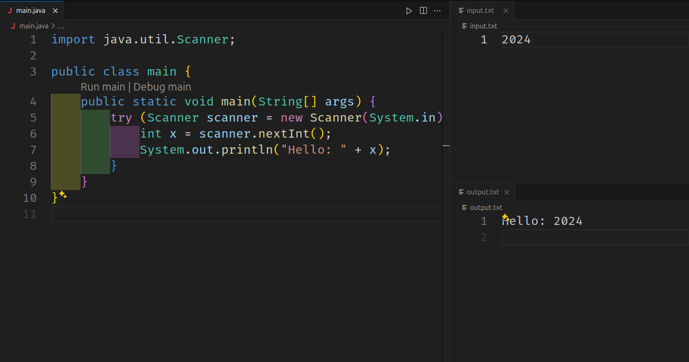

# Installation On Visual Studio Code

## File Creation

Create a new folder and open it in Visual Studio Code.
Create `main.java`, `input.txt`, and `output.txt` file in the folder.
Create a `main.java` file containing your code, an `input.txt` file, which is what you will give, and an `output.txt` file, where the output of your code will be printed.

## Setting Up in Visual Studio Code

1. Open Visual Studio Code: Launch Visual Studio Code.
2. Open the Command Palette: Press `Ctrl+Shift+P` (or `Cmd+Shift+P` on macOS).
3. Configure tasks.json: Type Tasks: Configure Task and select tasks.json.
4. Create tasks.json file from template: Select Others.
5. Replace existing content: Replace any existing content with the JSON configuration provided above.
6. Save and Use: Save (`Ctrl+S`) the file. Now, whenever you have a Java file open, you can run the task using `Ctrl+Shift+B` (or `Cmd+Shift+B` on macOS), which will compile and run your Java program according to the configured settings.

This configuration assumes you have [Java Development Kit (JDK)](https://www.oracle.com/java/technologies/downloads/) installed in local machine, Extension install in vs code is [Extension Pack for Java
](https://marketplace.visualstudio.com/items?itemName=vscjava.vscode-java-pack) and javac and java commands are accessible from the terminal. Adjust paths and filenames (input.txt, output.txt) as per your project's requirements.

**Settings:(In Short)**
`Menu bar` -> `Terminal` -> `Configure Tasks` -> `Create tasks.json file from template` -> `others`

After selecting others, you will see a new .vscode file and, in that, a `tasks.json` file, clear the current text in the json file and paste this.

**Windows User:**

```json
{
    "version": "2.0.0",
    "tasks": [
        {
            "label": "Compile and run",
            "type": "shell",
            "command": "",
            "args": [
                "java",
                "${relativeFile}",
                "<",
                "input.txt",
                ">",
                "output.txt"
            ],
            "presentation": {
                "reveal": "never"
            },
            "group": {
                "kind": "build",
                "isDefault": true
            },
            "problemMatcher": {
                "owner": "py",
                "fileLocation": ["relative", "${workspaceRoot}"],
                "pattern": {
                    "regexp": "^(.*):(\\d+):(\\d+):\\s+(warning|error):\\s+(.*)$",
                    "file": 1,
                    "line": 2,
                    "column": 3,
                    "severity": 4,
                    "message": 5
                }
            }
        }
    ]
}
```

**Linux User**

```json
{
    "version": "2.0.0",
    "tasks": [
        {
            "label": "compile and run",
            "type": "shell",
            "command": "javac ${file} && java ${fileBasenameNoExtension} < input.txt > output.txt",
            "group": {
                "kind": "build",
                "isDefault": true
            },
            "problemMatcher": ["$java-compilation", "$java-runtime"]
        }
    ]
}
```

**macOS User**

```json
{
    "version": "2.0.0",
    "tasks": [
        {
            "label": "compile and run",
            "type": "shell",
            "command": "javac ${file} && java ${fileBasenameNoExtension} < input.txt > output.txt",
            "group": {
                "kind": "build",
                "isDefault": true
            }
        }
    ]
}
```

Writing a program in python, press `ctrl+shift+B` for Windows/Linux to run the code and get the output.


