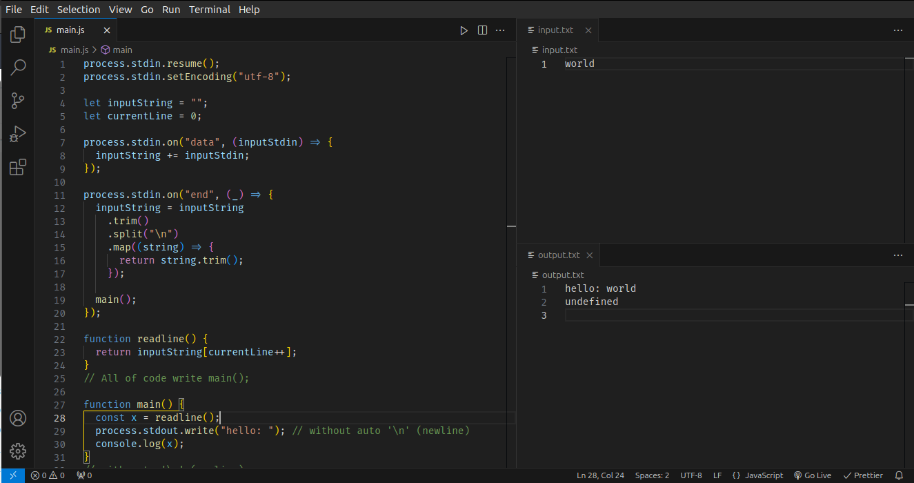
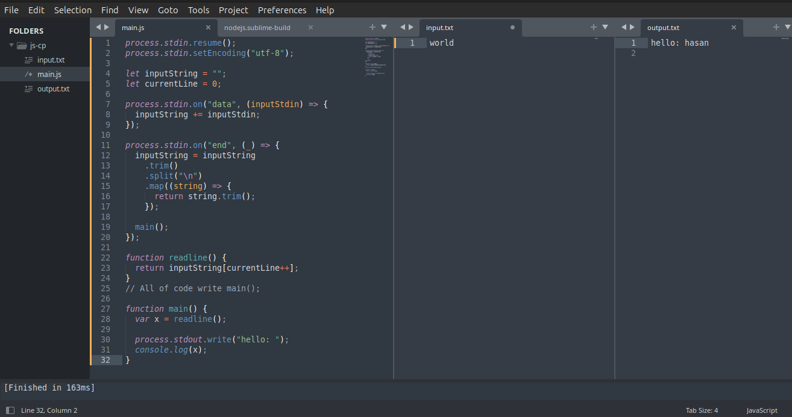

## Installation On Visual Studio Code

Create `main.js`, `input.txt`, and `output.txt` file.
You might additionally require [Node.js](https://nodejs.org/en/download) to run the code

Create a `main.js` file containing your code, an `input.txt` file, which is what you will give, and an `output.txt` file, where the output of your code will be printed.

**Settings:**
`Menu bar` -> `Terminal` -> `Configure Tasks` -> `Create tasks.json file from template` -> `others`

After selecting others, you will see a new .vscode file and, in that, a `tasks.json` file, clear the current text in the json file and paste this.

**Windows User:**

```JSON
{
  "version": "2.0.0",
  "tasks": [
    {
      "label": "Run JavaScript with Input/Output",
      "type": "shell",
      "command": "node",
      "args": [
          "${file}",
          "<",
          "input.txt",
          ">",
          "output.txt"
      ],
      "presentation": {
          "reveal": "never"
      },
      "group": {
          "kind": "build",
          "isDefault": true
      },
      "options": {
          "cwd": "${workspaceFolder}"
      }
    }
  ]
}
```

**Linux User:**

```json
{
  "version": "2.0.0",
  "tasks": [
    {
      "label": "Run JavaScript with Input/Output",
      "type": "shell",
      "command": "node",
      "args": ["${relativeFile}", "<", "input.txt", ">", "output.txt"],
      "presentation": {
        "reveal": "never"
      },
      "group": {
        "kind": "build",
        "isDefault": true
      },
      "options": {
        "cwd": "${workspaceFolder}"
      }
    }
  ]
}
```

Writing a program in javascript, press `ctrl+shift+B` for Windows/Linux to run the code and get the output.



## Installation On Sublime Text

Create `main.js`, `input.txt`, `output.txt` file.
You might additionally require [Node.js](https://nodejs.org/en/download) to run the code.

Create a `main.js` file containing your code, an `input.txt` file, which is what you will give, and an `output.txt` file, where the output of your code will be printed.

**Settings:**

`Tools`> `Build System` > `new build system` > `nodejs.sublime-build` > `save`

Paste in nodejs.sublime-build:

```json
{
  "shell_cmd": "cat $file_path/input.txt | node  $file > $file_path/output.txt"
}
```

Writing a program in javascript, press `ctrl+shift+B` for Windows/Linux to run the code and get the output.



### Sample

write down in main.js file:

```javascript
process.stdin.resume();
process.stdin.setEncoding("utf-8");

let inputString = "";
let currentLine = 0;

process.stdin.on("data", (inputStdin) => {
  inputString += inputStdin;
});

process.stdin.on("end", (_) => {
  inputString = inputString
    .trim()
    .split("\n")
    .map((string) => {
      return string.trim();
    });

  main();
});

function readline() {
  return inputString[currentLine++];
}
// All of code write main();

function main() {
  var x = readline();

  process.stdout.write("hello: ");
  console.log(x);
}
```

input.txt:

```
world
```

output.txt:

```
hello: world
```
