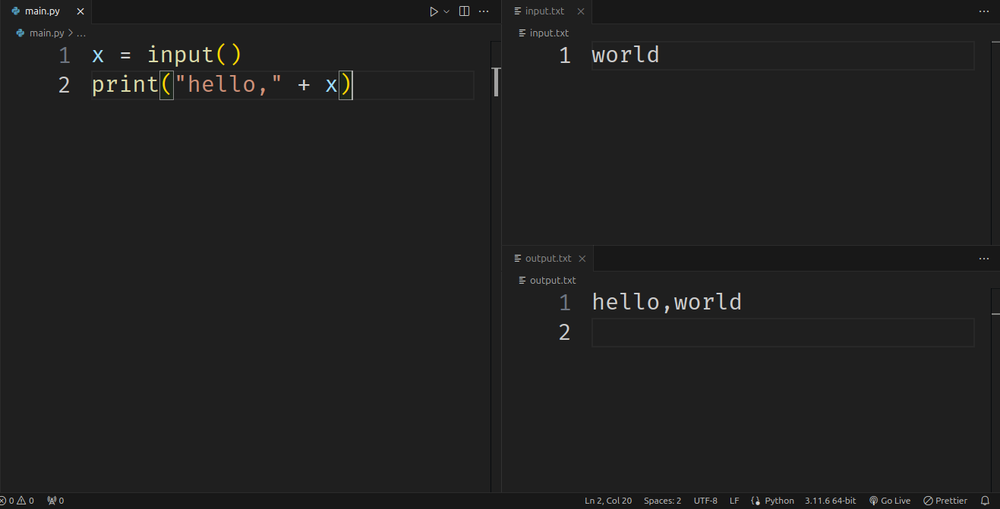

## Installation On Visual Studio Code

Create `main.py`, `input.txt`, and `output.txt` file.
You might additionally require [Python](hhttps://www.python.org/downloads/) to run the code
Install [Python](https://marketplace.visualstudio.com/items?itemName=ms-python.python) Extension.

Create a `main.py` file containing your code, an `input.txt` file, which is what you will give, and an `output.txt` file, where the output of your code will be printed.

**Settings:**
`Menu bar` -> `Terminal` -> `Configure Tasks` -> `Create tasks.json file from template` -> `others`

After selecting others, you will see a new .vscode file and, in that, a `tasks.json` file, clear the current text in the json file and paste this.

**Windows User:**

```json
{
  "version": "2.0.0",
  "tasks": [
    {
      "label": "Compile and run",
      "type": "shell",
      "command": "",
      "args": [
        "python3",
        "${relativeFile}",
        "<",
        "input.txt",
        ">",
        "output.txt"
      ],
      "presentation": {
        "reveal": "never"
      },
      "group": {
        "kind": "build",
        "isDefault": true
      },
      "problemMatcher": {
        "owner": "py",
        "fileLocation": ["relative", "${workspaceRoot}"],
        "pattern": {
          "regexp": "^(.*):(\\d+):(\\d+):\\s+(warning|error):\\s+(.*)$",
          "file": 1,
          "line": 2,
          "column": 3,
          "severity": 4,
          "message": 5
        }
      }
    }
  ]
}
```

**Linux User**

```json
{
  "version": "2.0.0",
  "tasks": [
    {
      "label": "Run Python Script",
      "type": "shell",
      "command": "python3",
      "args": ["${relativeFile}", "<", "input.txt", ">", "output.txt"],
      "presentation": {
        "reveal": "never"
      },
      "group": {
        "kind": "build",
        "isDefault": true
      },
      "problemMatcher": {
        "owner": "python",
        "fileLocation": ["relative", "${workspaceRoot}"],
        "pattern": {
          "regexp": "^(.*):(\\d+):(\\d+):\\s+(warning|error):\\s+(.*)$",
          "file": 1,
          "line": 2,
          "column": 3,
          "severity": 4,
          "message": 5
        }
      }
    }
  ]
}
```

Writing a program in python, press `ctrl+shift+B` for Windows/Linux to run the code and get the output.


